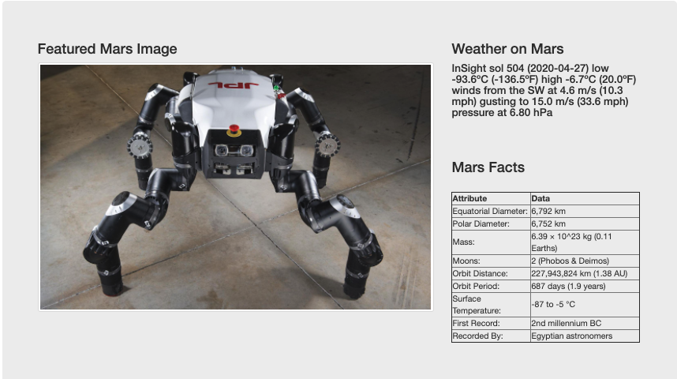
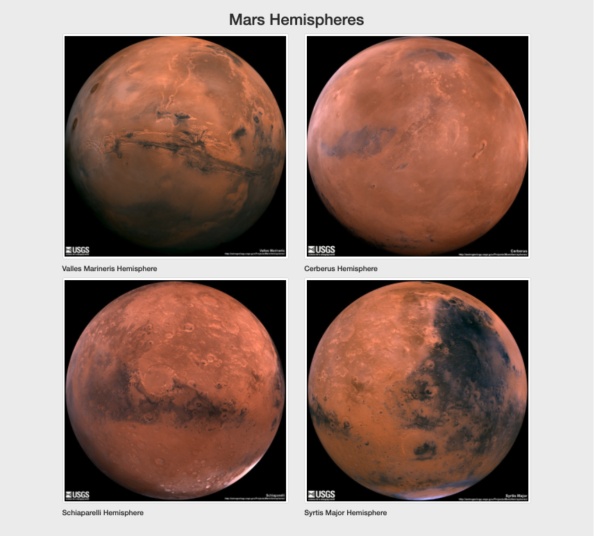
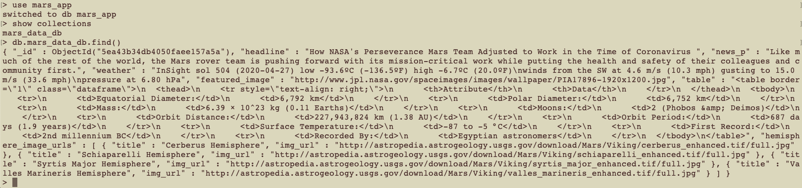

# Web Scraping Homework - Mission to Mars


This project builds a web application that scrapes various websites for data related to the Mission to Mars and displays the information in a single HTML page. 

### Repository Structure

1. A directory for web scraping called **Missions_to_Mars**.
    * *mission_to_mars.ipynb* contains all scraping functions in one file
    * The directory **Individual** contains individual scraping notebook files.
2. Screenshots of the application and the MongoDB are in the Images folder
3. *app.py* python script to run the flask app
4. *scrape_mars.py* python script to scrape data
5. The *Images* folder contains screenshots and one image for the readme
6. The *templates* folder contains *index.html* and *css* files
7. This *README* file

## Step 1 - Scraping

Initial scraping was realized using Jupyter Notebook, BeautifulSoup, Pandas, and Requests/Splinter.

* The Jupyter Notebook file called `mission_to_mars.ipynb` is used to complete all of your scraping and analysis tasks. The following sections outline the data scraped.

### NASA Mars News

* The [NASA Mars News Site](https://mars.nasa.gov/news/) 
    * The latest News Title and Paragraph Text was scaped and stored in variables for reference later.

```python
# Example:
news_title = "NASA's Next Mars Mission to Investigate Interior of Red Planet"

news_p = "Preparation of NASA's next spacecraft to Mars, InSight, has ramped up this summer, on course for launch next May from Vandenberg Air Force Base in central California -- the first interplanetary launch in history from America's West Coast."
```

### JPL Mars Space Images - Featured Image

* The URL for JPL Featured Space Image [here](https://www.jpl.nasa.gov/spaceimages/?search=&category=Mars).

* Splinter was used to navigate the site and find the image url for the current Featured Mars Image.  The URL was saved to a string claled `featured_image_url`.

* A full size `.jpg` image was found

* The complete url string for this image was saved

```python
# Example:
featured_image_url = 'https://www.jpl.nasa.gov/spaceimages/images/largesize/PIA16225_hires.jpg'
```

### Mars Weather

* The latest Mars weather tweet was scraped from  the Mars Weather twitter account [here](https://twitter.com/marswxreport?lang=en).  The tweet text for the weather report was saved as a variable called `mars_weather`.
* **Note: Be sure you are not signed in to twitter, or scraping may become more difficult.**
* **Note: Twitter frequently changes how information is presented on their website. If you are having difficulty getting the correct html tag data, consider researching Regular Expression Patterns and how they can be used in combination with the .find() method.**


```python
# Example:
mars_weather = 'Sol 1801 (Aug 30, 2017), Sunny, high -21C/-5F, low -80C/-112F, pressure at 8.82 hPa, daylight 06:09-17:55'
```

### Mars Facts

* The Mars Facts webpage [here](https://space-facts.com/mars/) was scraped using Pandas to scrape the table containing facts about the planet including Diameter, Mass, etc.

* The data was convereted to a HTML table string (using Pandas).

### Mars Hemispheres

* To obtain high resolution images for each of Mar's hemispheres.the USGS Astrogeology site [here](https://astrogeology.usgs.gov/search/results?q=hemisphere+enhanced&k1=target&v1=Mars) was used. 

* Each of the links to the hemispheres is needed in order to find the image url to the full resolution image.

* Both image url string for the full resolution hemisphere image, and the Hemisphere title containing the hemisphere name are saved. A Python dictionary is used to store the data using the keys `img_url` and `title`.

* The dictionary with the image url string and the hemisphere title is appended to a list. This list contains one dictionary for each hemisphere.

```python
# Example:
hemisphere_image_urls = [
    {"title": "Valles Marineris Hemisphere", "img_url": "..."},
    {"title": "Cerberus Hemisphere", "img_url": "..."},
    {"title": "Schiaparelli Hemisphere", "img_url": "..."},
    {"title": "Syrtis Major Hemisphere", "img_url": "..."},
]
```

- - -

## Step 2 - MongoDB and Flask Application

MongoDB with Flask templating created a new HTML page that displays all of the information that was scraped from the URLs above.

* The Jupyter notebook was converted into a Python script called `scrape_mars.py` with a function called `scrape` tha executes all of the scraping code from above and returns a  single Python dictionary containing all of the scraped data.

* A route called `/scrape` imports `scrape_mars.py` script using the `scrape` function.

  * The return value is stored in Mongo as a Python dictionary.

* The root route `/` that queries the Mongo database and passes the mars data into an HTML template to display the data.

* A template HTML file called `index.html` takes the mars data dictionary and displays all of the data in the appropriate HTML elements. The final site looks like this. 




* The Mongo Database is called *mars_app* with collection *mars_data_db* looks like this


- - -

## Step 3 - Submission

The following has been uploaded:

1. The Jupyter Notebook containing the scraping code used.
    * Note in there are five separate notebooks in the directory *Individual* that contain individual scrapings 

2. Screenshots of the final application are shown above

3. The link to this repository has been submitted BootCampSpot.

## Additional

* Splinter was used to navigate the sites when needed and BeautifulSoup to help find and parse out the necessary data.
* Pymongo was used for CRUD applications for the database. For this project, the existing document is overwritten each time the `/scrape` url is visited and new data is obtained.
* Bootstrap was used to structure the HTML template.

### Copyright

Ann McNamara © 2020. All Rights Reserved.
